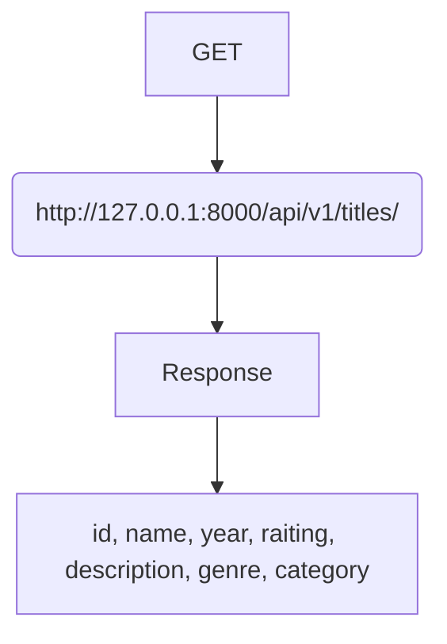
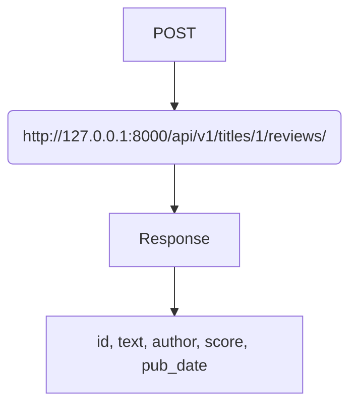

# YaMDb
<div id="badges">
    
</div>

______________________________
#### Описание:
Учебный проект создан, чтобы вы и другие пользователи могли написать свое мнение о книгах, фильмах, музыке и многом другом. 
Делитесь мнением, оценивайте произведения, смотрите отзывы других.
________________________

#### Авторами является команда из трёх начинающих отважных программистов:
- [Екатерины Серовой](https://github.com/EISerova/),
- [Анны Бакарасовой](https://github.com/Bakarasik),
- [Владимира Мазняка](https://github.com/Cognitoid).
__________________________

#### Зависимости:
* Python 3.8
* Django 2.2
* Django rest framework 3.12
* JWT 2.1

__________________________

#### Как запустить проект:
- Клонировать репозиторий:\
```git clone https://github.com/EISerova/api_yamdb```\
```cd api_yamdb```

- Создать и активировать виртуальное окружение:\
```python3 -m venv env```\
```source env/bin/activate```

- Установить зависимости из файла requirements.txt:\
```python -m pip install --upgrade pip```\
```pip install -r requirements.txt```

- Выполнить миграции:\
```python manage.py migrate```

- Запустить сервер:\
```python manage.py runserver```
______________________

#### Импорт данных:
В базу данных можно импортировать csv-файлы:\
```python manage.py import_csv```
______________________

#### Техническое описание проекта:
На [странице с документацией redoc](http://127.0.0.1:8000/redoc/) можно ознакомиться с примерами запросов и ответов на них.
______________________

#### Примеры API-запросов:
 Получение списка всех произведений.


Добавить новый отзыв к произведению с id 1.

______________________

#### Для регистрации пользователь может самостоятельно отправить свой username и email на [/auth/signup/](http://127.0.0.1:8000/api/v1/auth/signup/). После этого он получает письмо с кодом подтвержения. 

Далее необходимо получит токен для аутентификации, использовав код и передав его вместе с username по адресу [/auth/token/](http://127.0.0.1:8000/api/v1/auth/token/).
